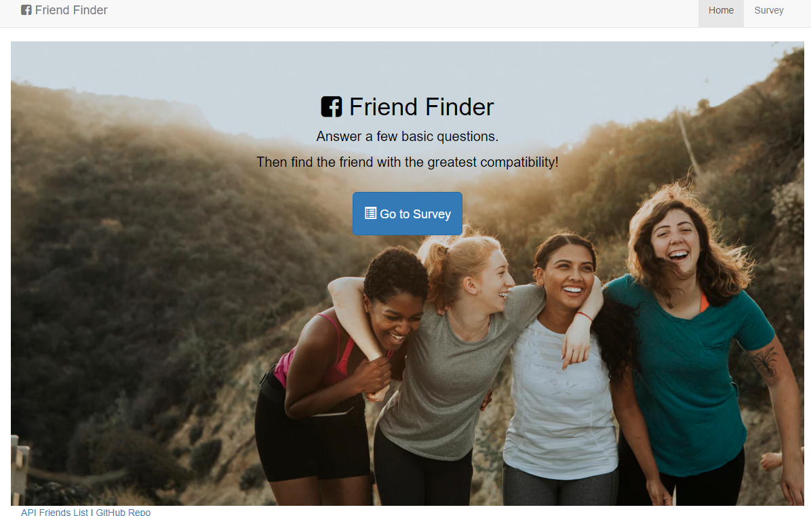
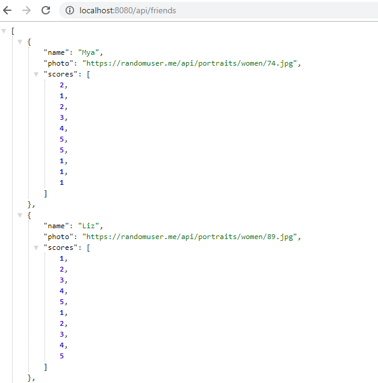

# FriendFinder
Find a friend who's compatible with you. 

FriendFiner is a full-stack site will take in results from users' surveys, then compares their answers with those from other users in order to find the best match. The app displays the name and picture of the user with the best overall match.

I used Express to handle routing. This app is available on this Heroku link.

TO-DO - Heroku link

# Key Features 

The app has 2 HTML pages

* Home Page. This is the first page a user sees when the application is launched. It has a link to the survey page.
* Survey Page. This is where a user fills out the survey. Once all questions are answered and submitted, the name and picture of the most compatible friend are displayed in a pop-op.

# Technology used

* Express
* Path

# Screenshots

## Home page

## Survey Page

## API displaying all friends

